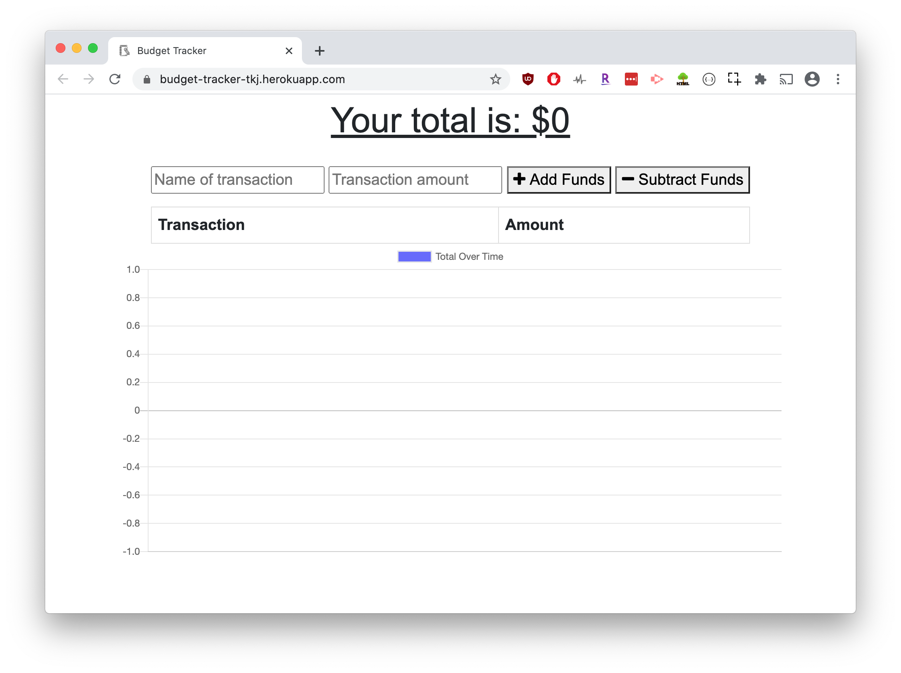
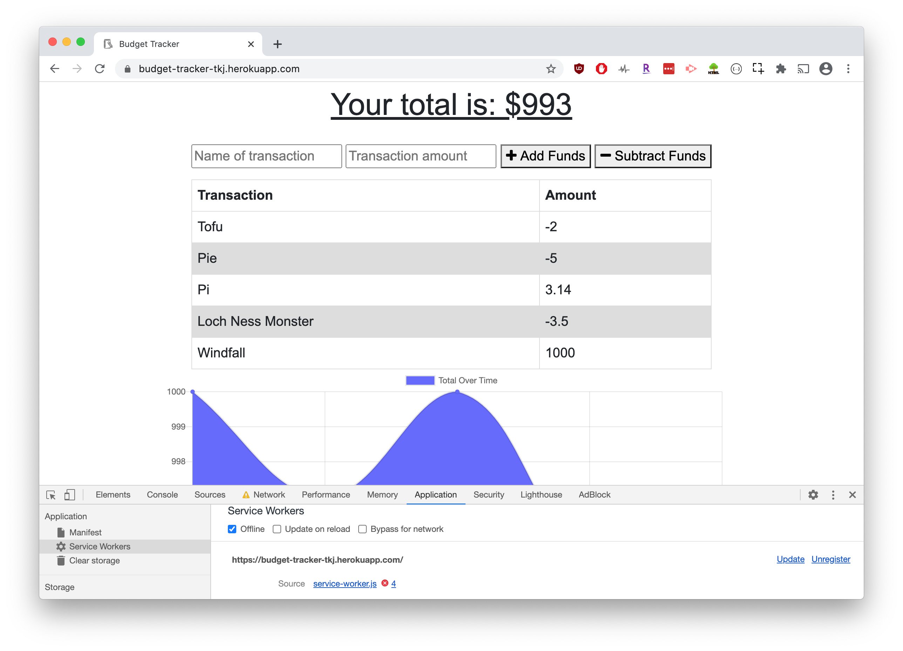

# BudgetTracker

# General Info
- Budget Tracking application -- tracks your transactions and outputs the results to a graph (via chart.js) and table.
- The application can also be installed as a PWA (Progessive Web App) for offline use.
- Use the Application here: [Budget Tracker](https://budget-tracker-tkj.herokuapp.com/).


#### Built With: 
- Mongo database
- Mongoose schema 
- Routes with Express 
- Chart.js for Graphic
- HTML, CSS, JavaScript and jQuery for the front end
- Compression - Middleware for gzip compression
- Offline Functionality enabled by a Service Worker


#### Goal/Scenario: 
- The overall goal of this application was to adapt the application for offline use. The Application front end with back end functionality was provided by the Boot Camp, much like a component team might deliver a PBI to a downstream team. My main focus as that downstream team was -- create the _Web Manifest_, create the _Service Worker_, and deploy that application to Heroku (Prod) with Offline functionality.


#### Appication Overview:
__Online App__


- Input a Transaction with a **Name** and **Cost**
- Click either **Add Funds** or **Subtract Funds** for the Transaction type
- The Transaction is logged to a table, so you can see a list of transactions
- The Graph updates based on your transactions, so you can see changes over time
- At the top of the page, you can see the total of All Transactions

__Offline App__

- You can use the application offline, by _Right Clicking_ the webpage, selecting _Inspect_, then _Application_ and _Service Worker_ tab.
- In the _Service Worker_ tab, you can then check the **Offline** box
- Once the **Offline** box is unchecked, any transaction updates made will be incorporated into the Web Application! 

## Deployment

#### Locally

To install and use locally,

1. `git clone` the repository to a local directory
2. In the terminal, `cd` to the repository directory and run

```bash
npm i
```

3. Then start the application with:

```bash
node server.js
```

4. You can then navigate to [http://localhost:3000/](http://localhost:3000/) in your browser of choice

#### Online
All that being said, you can find the deployed application on Heroku. Navigate to the [Budget Tracker](https://budget-tracker-tkj.herokuapp.com/) online and save yourself some time and effort!
